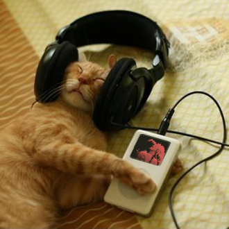

# ipod kitty

an endpoint that takes a spotify trackid and redirects to an image
of a cat listening to that song on an ipod.

this api uses my own canvas api to generate the image so unfortunately you cannot run this locally.

you can however play around with the canvas api at https://canvas.ncp.nathanferns.xyz/playground

it's free
